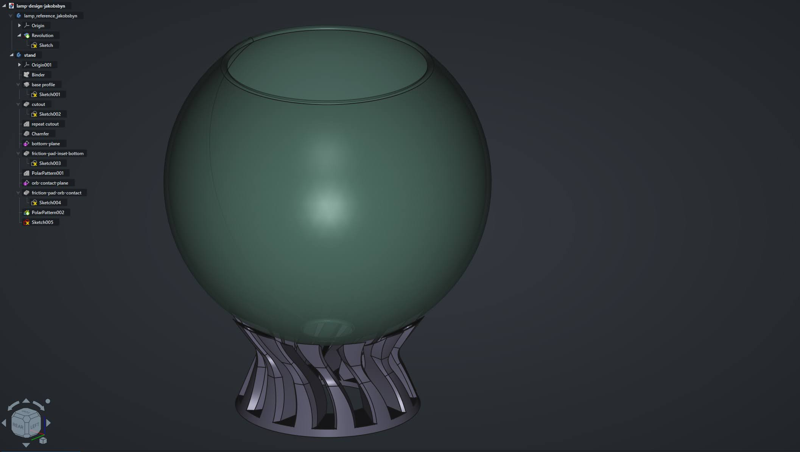
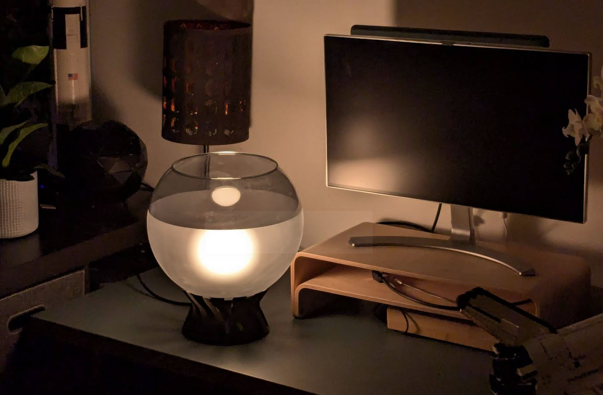
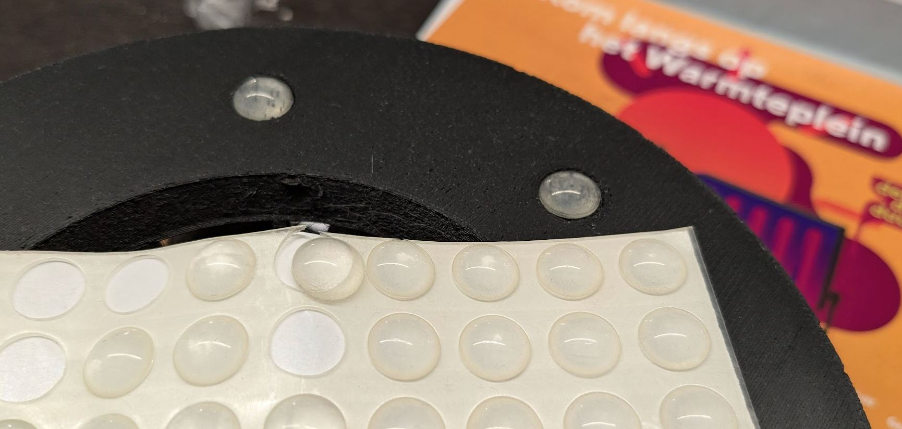

# Printable Stand for IKEA Jacobsbyn lamp

Turn your IKEA Jacobsbyn into  a table lamp with a simple 3D print. Printable on a Prusa Mini+ (18x18x18cm volume). 

I recently replaced my [IKEA Jacobsbyn (frosted variant)](https://www.ikea.com/nl/en/p/jakobsbyn-pendant-lamp-shade-frosted-glass-grey-90473325/#content) with a different ceiling lamp as I think the exposed bulb that is intrinsic to the Jacobsbyn  design is not very pleasant. Since the glass element is rather nice, I figured I could repurpose the lamp into a table lamp. By putting it on an elevated surface (e.g. a wardrobe) the bulb itself will be fully hidden.

### About the design

There are two printable designs:

1. A base design in `jakobsbyn-stand.step`
2. The same as above, but with some cosmetic chamfers in `jakobsbyn-stand-chamfer.step`

The designs feature some recessed parts for anti-slip pads to slot into. The versions I used are domed units with diameter 10mm and height ~3mm.

